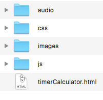

-----------------------------------------------
# VEX IQ Timer and Score Calculator
## Using html, javascript, CSS
#### Posted by glydeck 9/16/2024
-----------------------------------------------

## Introduction
This is a simple timer and score calculator designed to work as a stand alone package. It's based on existing VEX timer / calculators available on the internet. The only difference is that all of the files including images and audio are available in this package and do not require access to the Internet.


## Requirements to Use VEX Timer & Calculator

Download code and use with any Browser.  
## Usage

 The folders audio, css, images and js should be at the same directory level as the html file. Launch by opening the html file **timerCalculator.html**.
 
 ##### Directory Layout
 
 

## Contents
```
    README.md            -This document
    timerCalculator.html -html for the page
    timerCalculator.css  -Cascading Style Sheet
    timerCalculator.js   -Javascript code for the timer and calculator
    audio                -Folder with audio files
    images               -Folder of images used on the Timer Calcullator
```
